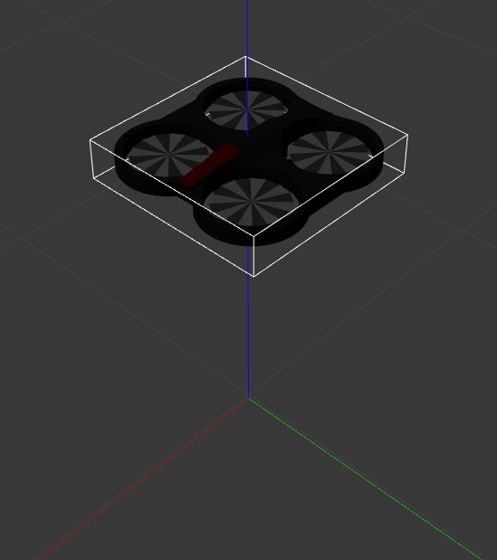
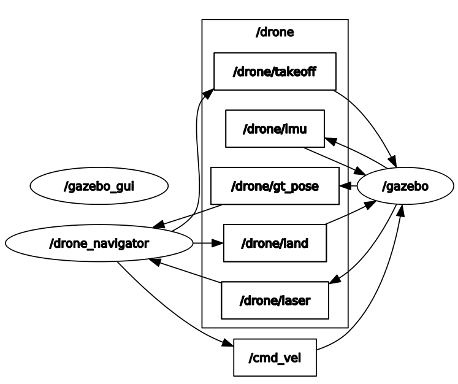

# Insall
- [source](https://automaticaddison.com/how-to-set-up-the-ros-navigation-stack-on-a-robot/)
```
sudo apt-get install ros-noetic-navigation
```
- map and navigation servers [link](https://answers.ros.org/question/244237/rosrun-map_server-map_server-couldnt-find-executable/)
# Drone simulation
- inspired by [link](https://github.com/NovoG93/sjtu-drone)
# TOdo
- [ ] float occupancy map before feeding it to A* to maintain a safe distance from obstacles
- [ ] give A* path to path optimizer
- [ ] give path optimizer to LQR or time varying LQR
- [ ] write non-linear version of the system
- [ ] do it on a different map and create map for it (we can do it for coridors in construct sim)
- [ ] do 3d A*
# ROS Package Details

I created this package by editing the sjtu Drone simulation in GitHub repo [link](https://github.com/NovoG93/sjtu-drone). The original repo had some bugs. After fixing them, I added a laser sensor to the drone and implemented ```drone_navigator``` node. I tested this package on my system, which is utilized with **ROS Noetic (Ubuntu 20.04)** and **Gazebo version 11.10.2**.

## Drone Details


Drone has only two sensors: 
1. Laser Scanner (/drone/laser)
2. IMU (/drone/imu)

The rqt_graph for this package is provided below:



## Downloading and running
Clone this repository, install dependencies and build following the commands below:
```
cd ~/catkin_ws
rosdep install -r -y --from-paths src --ignore-src --rosdistro $ROS_DISTRO 
catkin_make
source devel/setup.bash
```
For running, execute the command below.
```
roslaunch sjtu_drone start.launch
```
